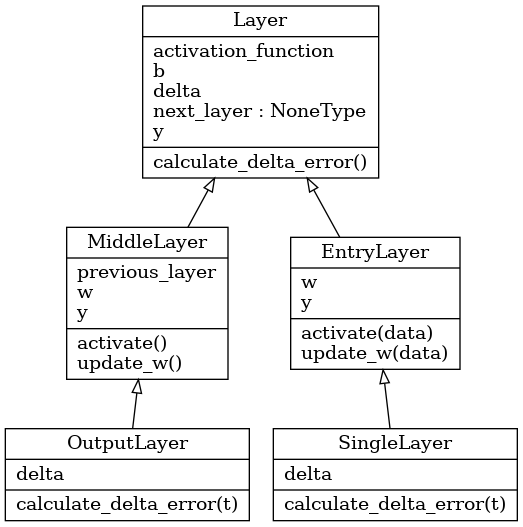

Étudiants : Emna Barred & Nabil Lamrabet.

Encadrant : Mathieu Lefort.

2ème année Master informatique parcours intelligence artificielle
2020-2021

Bio-Inspired Intelligence


# TP Introduction à l'apprentissage profond

## Répartition du travail

Nous avons travaillé ensemble sur les réponses aux questions concernant les hyper-paramètres. Concernant la partie 2, le perceptron multi-couches avec uniquement les tenseurs est essentiellement écrit par Nabil là où Emna s'est focalisée sur les versions `Pytorch`.

## Partie 1 : Perceptron

> Indiquer la taille de chaque tenseur dans le premier fichier. Expliquer.

On sait que les images 28x28 sont stockés sous forme de vecteur de dimension [784] et les labels sous forme de vecteur de dimension [10].

Nous avons le tenseur data_train qui est une matrice contenant  63 000 images de dimension [784], il s'agit donc d'une matrice de dimension [63 000, 784] :

```python
data_train = [[image_1[784], image_2[784], ..., image_63_000[784]]
```
C'est pareil pour label_train (63 000  * label[10]), data_test (63 000 * image[784]) et label_test (nombre images * label[10]). On peut les penser de la forme suivante :

```python
label_train = [[label_1[10], label_2[10], ..., label_63_000[10]]]
data_test = [[image_1[784], image2_[784], ..., image_63_000[784]]
label_test = [[label_1[10], label_2[10], ..., label_63_000[10]]
```

On peut vérifier ces valeurs avec l'attribut `shape` des vecteurs/matrices qui permet de retourner leur(s) dimension(s). Par exemple `data_train.shape = [63000, 784]` et `label_train.shape = [63000, 10]`.


w est une matrice contenant pour chaque donnée en entrée et chaque neurone de la couche (ici il n'y en a qu'une) le poids du couple donnée-neurone.

Dans notre modèle perceptron, nous avons une couche unique contenant 10 neurones. Ainsi, les dimensions de w sont [784, 10]. Pour chaque neurone nous avons un biais, les dimensions de b sont donc [1, 10].

> Quantifier l’impact des différents hyper-paramètres (en particulier eta et les poids initiaux) sur les performances.

Le paramètre eta correspond au taux d'apprentissage. Étant donné que notre fonction d'activation est une simple somme pondérée, la fonction d'erreur quadratique est une parabole avec un minimum global. Si notre eta est trop élevé, on risque de passer à côté du minimum global. Plus on réduit eta, plus l'apprentissage est lent mais on peut obtenir à terme des performances très légèrement meilleures. Par exemple, sur un grand nombre d'époques (100 par exemple), en passant d'un eta de 0.00001 à 0.000005 on passe d'une performance finale moyenne de 0.8590 à 0.860. Le résultat est négligeable au vu du nombre d'époques utilisées pour y arriver.

Concernant les poids initiaux, si on augmente l’intervalle (par exemple [-0.01,  0.01] et plus) on perd en performances. On peut penser que réduire l'intervalle améliore les performances, néanmoins au-delà de [-0.001, 0.001] on ne constate pas d'amélioration (mais pas de régression non plus).

## Partie 2 : Shallow network


Pour implémenter notre perceptron multi-couches, nous avons créé un module `neuron.py`. Il s'agit d'un module nous permettant de créer facilement un réseau de neurones et permettant de faire varier le nombre de couches, de fonctions d'activations et de neurones. L'implémentation est écrite sous le paradigme de programmation orientée objet (cf le diagramme de classes Figure 1).



Nous avons donc un fichier `single_layer.py` qui correspond à un simple perceptron et `two_layers.py` qui correspond à un perceptron multi-couches (une couche d'entrée, une couche de sortie et aucune couche cachée). Les deux fichiers utilisent le module précédemment cité.


Le fichier `single_layer.py` fonctionne correctement, en revanche pour le fichier `two_layers.py` il y a un bug de code qui empêche au réseau d'apprendre. Étant donné que nous n'avons pas exactement suivi les bonnes pratiques de code (absence de tests unitaires) et au vu du paradigme de programmation choisi (orienté objet), il est assez compliqué d'isoler le problème. Nous avons passé beaucoup de temps à essayer de le résoudre sans succès, nous décidons donc de ne pas plus nous attarder dessus. Le code écrit nous a tout de même permis de bien comprendre le mécanisme interne de ce type de réseau neuronal, on comprend également l'utilité d'utiliser un framework de ce type (moins de code et d'erreurs de code, on se concentre plus sur le réseau que sur l'implémentation).

La version utilisant tous les outils `PyTorch` se trouve dans le fichier `two_layers_pytorch.py`.

On définit les couches de la façon suivante :


```python
entry_layer = torch.nn.Linear(data_train.shape[1], 37)
output_layer = torch.nn.Linear(37, label_train.shape[1])

model = torch.nn.Sequential(entry_layer, torch.nn.Sigmoid(), output_layer)
```

Ainsi, pour l'activation de toutes les couches on fait simplement `y = model(x)`.


Ci-dessus, nous avons une première couche linéaire à laquelle on applique une fonction sigmoïde (donc on considère qu'il s'agit d'une couche ayant une fonction d'activation sigmoïde).

Si on considère que les couches cachées sont les couches intermédiaires (on exclut donc la couche d'entrée et de sortie) ce réseau n'a donc aucune couche cachée (elle a une couche d'entrée et de sortie seulement). Nous ne sommes pas totalement sûr qu'il s'agisse bien de la bonne définition néanmoins.

Étant donné qu'il est demandé dans le sujet d'écrire un réseau avec une couche cachée, cela est fait dans le fichier `three_layers_pytorch.py`.

On modifie ce qui a été écrit précédemment pour ajouter une couche.

```python
entry_layer = torch.nn.Linear(data_train.shape[1], 37)
middle_layer = torch.nn.Linear(37, 60)
output_layer = torch.nn.Linear(60, label_train.shape[1])

model = torch.nn.Sequential(entry_layer, torch.nn.Sigmoid(), middle_layer,
        torch.nn.Sigmoid(), output_layer)
```
> Quantifier l'influence des différents hyper-paramètres (en particulier eta, les poids initiaux et le nombre de neurones par couche cachée).


Il est préférable d'avoir eta autour 0.001 pour une couche sigmoïde. Le nombre de nœuds par couche améliore les performances lorsqu'on en rajoute mais on peut pas dire qu'il y ait une corrélation stricte entre performance et nombre de neurones de la couche cachée. Au-delà de 37 on n'obtiens pas de meilleures performances.

Globalement il ne semble pas y avoir de méthode pour trouver des hyper-paramètres nous permettant d'obtenir une pondération d'un réseau donnant des résultats "optimaux". En revanche il existe des valeurs pour les hyper-paramètres permettant d'obtenir une pondération du réseau donnant des résultats "optimaux" (il faut donc les chercher par tâtonnement).

## Partie 3 : Deep network

> Implémenter un réseau de neurones profond (i.e. avec au moins 2 couches cachées) en utilisant les outils fournis par Pytorch.

Dans le fichier `deep_network.py` nous avons créé une réseau avec deux couches cachées contenant chacunes 60 neurones :

```python
entry_layer = torch.nn.Linear(data_train.shape[1], 37)
middle_layer_1 = torch.nn.Linear(37, 60)

middle_layer_2 = torch.nn.Linear(60, 60)

output_layer = torch.nn.Linear(60, label_train.shape[1])

model = torch.nn.Sequential(entry_layer, torch.nn.Sigmoid(), 
        middle_layer_1, torch.nn.Sigmoid(), 
        middle_layer_2, torch.nn.Sigmoid(), output_layer)
```

> Quantifier l'influence des différents hyper-paramètres (en particulier eta, les poids initiaux, le nombre de couches cachées et le nombre de neurones par couche cachée).

Concernant le nombre de neurones des couches cachées on fait les mêmes remarques que précédemment. En revanche lorsqu'on ajoute une couche on commence avec un taux de réponses justes de 0.10 et on finit avec 0.93 au bout 40 époques (là où précédemment on avait de 0.83 à 0.96 en 10 époques).

Si on ajoute encore une couche intermédiaire sigmoide à 60 neurones notre réseau plafonne à un taux de réponse de 0.10.

Ce résultat nous semble assez inattendu, nous ne pensions pas qu'ajouter une couche pouvait réduire les performances (ou alors nous avons commis une erreur de code quelque part). Nous nous attendions à faire mieux en deep network qu'en perceptron multi-couches sans couche intermédiaire. En revanche nous n'avons pas ce problème en remplaçant la fonction d'activation sigmoïde par ReLU. Avec la fonction ReLU on observe ce à quoi nous nous attendions (une amélioration quand on ajoute des couches ou des neurones jusqu'à un certain nombre).

## Partie 4 : Pour aller plus loin

Nous avons fait les différents tests sur notre réseau `tests.py`.

Voici quelques benchmarks rapides sur les fonctions d'activation :

Référentiel (linéaire) :

```python
BATCH_SIZE = 5
NB_EPOCHS = 10
ETA = 0.0001

entry_layer = torch.nn.Linear(data_train.shape[1], 37)
output_layer = torch.nn.Linear(37, label_train.shape[1])
model = torch.nn.Sequential(entry_layer, output_layer)

tensor([0.8474])
tensor([0.8524])
tensor([0.8541])
tensor([0.8597])
tensor([0.8590])
tensor([0.8601])
tensor([0.8571])
tensor([0.8583])
tensor([0.8606])
tensor([0.8594])
```
Avec `ETA = 0.00001`

```python
tensor([0.7171])
tensor([0.7884])
tensor([0.8140])
tensor([0.8251])
tensor([0.8293])
tensor([0.8359])
tensor([0.8383])
tensor([0.8414])
tensor([0.8436])
tensor([0.8461])
```

Référentiel (sigmoïde) :

```python
BATCH_SIZE = 5
NB_EPOCHS = 10
ETA = 0.0001

entry_layer = torch.nn.Linear(data_train.shape[1], 37)
output_layer = torch.nn.Linear(37, label_train.shape[1])
model = torch.nn.Sequential(entry_layer, torch.nn.Sigmoid(), output_layer)

tensor([0.7564])
tensor([0.8009])
tensor([0.8283])
tensor([0.8409])
tensor([0.8520])
tensor([0.8523])
tensor([0.8591])
tensor([0.8609])
tensor([0.8611])
tensor([0.8664])
```

Tanh:
```python
BATCH_SIZE = 5
NB_EPOCHS = 10
ETA = 0.0001

entry_layer = torch.nn.Linear(data_train.shape[1], 37)
output_layer = torch.nn.Linear(37, label_train.shape[1])
model = torch.nn.Sequential(entry_layer, torch.nn.Tanh(), output_layer)


tensor([0.8557])
tensor([0.8671])
tensor([0.8750])
tensor([0.8884])
tensor([0.8983])
tensor([0.9043])
tensor([0.9086])
tensor([0.9107])
tensor([0.9131])
tensor([0.9151])
```

ReLU:
```python
BATCH_SIZE = 5
NB_EPOCHS = 10
ETA = 0.0001

entry_layer = torch.nn.Linear(data_train.shape[1], 37)
output_layer = torch.nn.Linear(37, label_train.shape[1])
model = torch.nn.Sequential(entry_layer, torch.nn.ReLU(), output_layer)

tensor([0.8676])
tensor([0.8926])
tensor([0.9059])
tensor([0.9119])
tensor([0.9170])
tensor([0.9199])
tensor([0.9236])
tensor([0.9260])
tensor([0.9279])
tensor([0.9289])
```

Comme attendu, c'est avec ReLU puis Tanh qu'on obtient les meilleurs performances.


En initialisation Xavier on obtient :

```python
BATCH_SIZE = 5
NB_EPOCHS = 10
ETA = 0.0001

entry_layer = torch.nn.Linear(data_train.shape[1], 37)
output_layer = torch.nn.Linear(37, label_train.shape[1])

model = torch.nn.Sequential(entry_layer, torch.nn.Sigmoid(), output_layer)

torch.nn.init.xavier_uniform_(entry_layer.weight)
torch.nn.init.xavier_uniform_(output_layer.weight)

tensor([0.7873])
tensor([0.8301])
tensor([0.8447])
tensor([0.8499])
tensor([0.8579])
tensor([0.8641])
tensor([0.8663])
tensor([0.8697])
tensor([0.8736])
tensor([0.8753])
```

On obtient une amélioration de 0.2-0.3 environ par rapport à une initialisation uniforme simple.

Nous essayons de changer de méthode de gradient.

Adam :

```python
BATCH_SIZE = 5
NB_EPOCHS = 10
ETA = 0.0001

entry_layer = torch.nn.Linear(data_train.shape[1], 37)
output_layer = torch.nn.Linear(37, label_train.shape[1])
model = torch.nn.Sequential(entry_layer, torch.nn.Sigmoid(), output_layer)
optim = torch.optim.Adam(model.parameters(), lr=ETA)

tensor([0.8877])
tensor([0.9133])
tensor([0.9246])
tensor([0.9304])
tensor([0.9347])
tensor([0.9386])
tensor([0.9403])
tensor([0.9413])
tensor([0.9427])
tensor([0.9453])
```

Adagrad :

```python
BATCH_SIZE = 5
NB_EPOCHS = 10
ETA = 0.0001

entry_layer = torch.nn.Linear(data_train.shape[1], 37)
output_layer = torch.nn.Linear(37, label_train.shape[1])
model = torch.nn.Sequential(entry_layer, torch.nn.Sigmoid(), output_layer)
optim = torch.optim.Adagrad(model.parameters(), lr=ETA)

tensor([0.5614])
tensor([0.6446])
tensor([0.6767])
tensor([0.6949])
tensor([0.7053])
tensor([0.7136])
tensor([0.7214])
tensor([0.7279])
tensor([0.7353])
tensor([0.7400])
```

Nous obtenons des perfomances supérieures avec Adam mais bien moins bonnes avec Adagrad.

En apportant ce qui fonctionne le mieux dans notre réseau profond on arrive à obtenir un taux de réussite de 0.97 au bout de 10 époques.